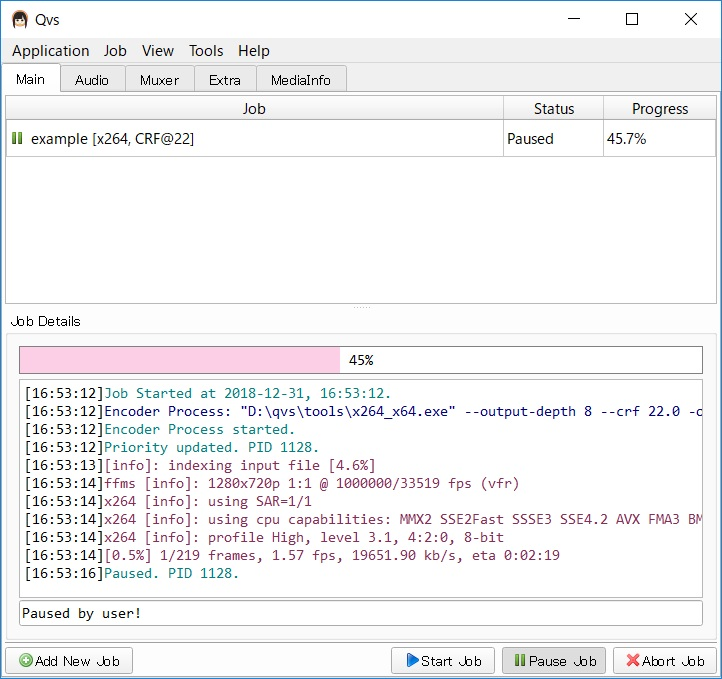
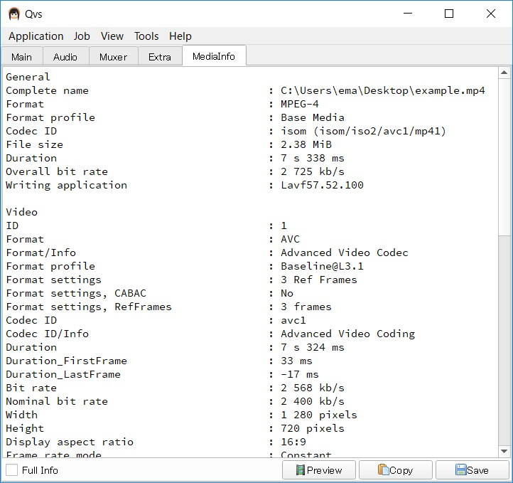
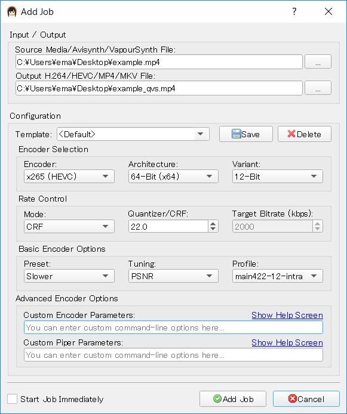
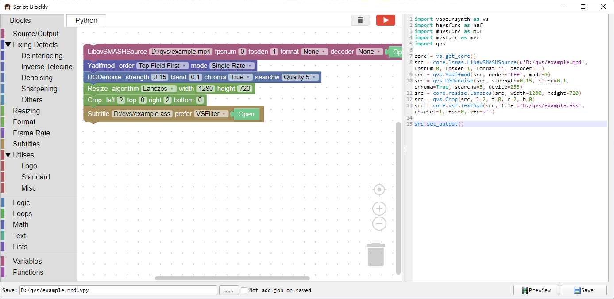
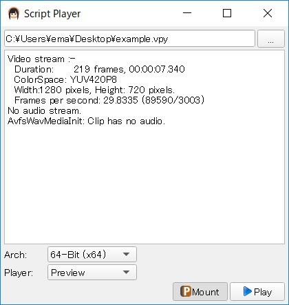
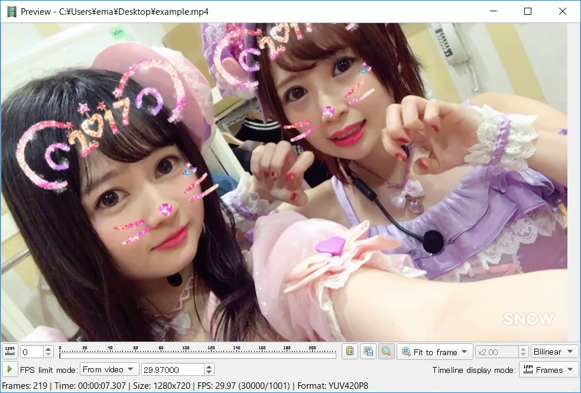

# qvs

A simple program for using VapourSynth/Avisynth Script previewed and encoded.

## Download

You can download from [releases](https://github.com/emako/qvs/releases) page.

See the [changelog.md](changelog.md) page.

## Main Features

- [x] New script(*.vpy), also using blockly, a visual programming tools.
- [x] Encode script(*.vpy) or video, also using x264/x265/NVEnc/QSVEnc/VCEEnc encoders.
- [x] Encode audio, also using AAC/MP3/ALAC/FLAC/OPUS/OGG Vorbis/AC3/WAV encoders.
- [x] Muxer video and audio, also using MP4Box/L-smash/MKVMerge/FFMpeg tools.
- [x] Demuxer video, also using FFMpeg/Eac3to/MKVExtract/TsDemux tools.
- [x] Create single image video.
- [x] Splite/Merge media file.
- [x] Show MediaInfo.

## Screen Shot

- ##### Main UI

  

- ##### Mediainfo UI

  

- ##### Create Script from Add New Job

  

- ##### Create Script from blockly UI

- ##### Script Mount UI

- ##### Script Preview UI

## Building

qvs is developed based on Qt5.

See [equipment.md](https://github.com/emako/qvs/blob/master/equipment.md) for more details.

## License

qvs is licensed under the [MIT](https://github.com/emako/qvs/blob/master/LICENSE) License.

